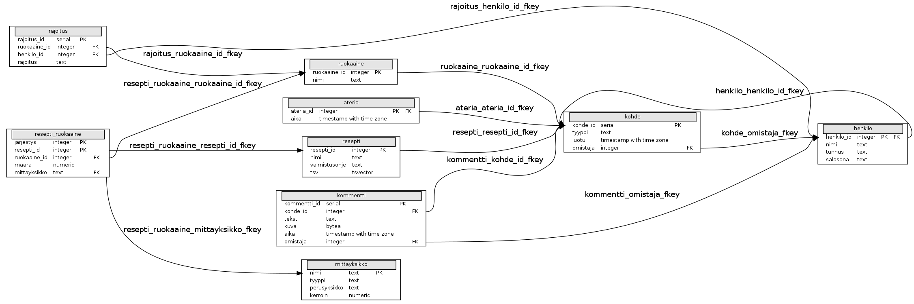
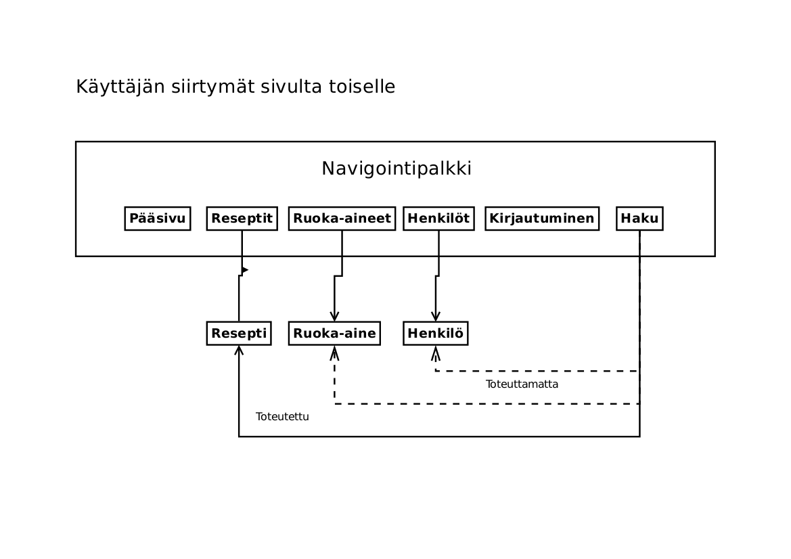
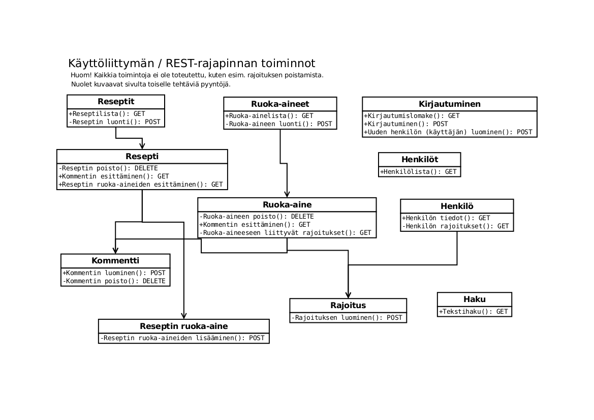

===================================
Rohmotti — elektroninen keittokirja
===================================

.. contents:: Sisällysluettelo

.. raw:: pdf

  PageBreak

1. Johdanto
***********

Rohmotti on websovellus, jonka avulla ylläpidetään tietokantaa
ruoka-aineista, resepteistä ja aterioista sekä henkilöistä, jotka ovat
aterioille osallistuneet. Elektronisen keittokirjan avulla on
mahdollista tehdä ruoka-aineisiin, resepteihin, aterioihin ja
henkilöihin kohdistuvia hakuja. Sovelluksella voi myös tehdä
ostoslistan reseptin tai aterian perusteella. Resepti koostuu
ruoka-ainelistasta ja valmistusohjeesta. Ateria sisältää yhden tai
useamman reseptin ja mahdolliset ruokajuomat. Ateriaan liittyy myös
aika, paikka ja aterialle osallistuneet henkilöt — yhtenä tavoitteena
onkin olla tarjoamatta vahingossa samaa ruokalajia useampaan kerran
samalle henkilölle! Henkilöihin voi liittää tietoja rajoituksista
kuten ruokavalioista tai ruoka-aineallergioista. Lisäksi eri
kohteisiin on mahdollista liittää valokuvia ja kommentteja.

Ympäristö
---------

Ohjelma toteutetaan Python-ohjelmointikielellä CGI-ympäristössä.
Tietokantajärjestelmänä käytetään PostgreSQL:ää.

Ohjelman rakenne toteutetaan käyttäen Model-View-Controller-tyyliä.

Järjestelmän käyttäminen edellyttää tunnistautumista. Tunnistautunut
käyttäjä saa sessioavaimen, joka on voimassa määrätyn ajan
tunnistautumisesta (tai viimeisestä käyttäjän toiminnosta).

Tietokantakyselyjen muodostaminen tehdään niin, että kaikkea
käyttäjältä peräisin olevaa tietoa käsitellään huolellisesti. Tämä
tarkoittaa mm. järjestelmällistä parametroitujen kyselyjen hyödyntämistä.

Hakutoiminnoissa hyödynnetään PostgreSQL:n Full Text Search
-ominaisuutta.

Ohjelman riippuvuudet ovat tarkoituksellisesti minimaaliset:
PostgreSQL, Python + standardimodulit, Psycopg2, PyCrypto.

2. Yleiskuva järjestelmästä
***************************

Rohmotin käyttäjäryhmät ovat hyvin yksinkertaiset: Rohmottia voi
selata ja reseptejä kommentoida kirjautumatta. Jos luo
käyttäjätunnuksen, niin käyttäjällä on luku- ja kirjoitusoikeudet
kaikkeen tietoon.

Rohmotissa voi myös olla henkilöitä, jotka eivät ole käyttäjiä.
Tällaiset henkilöt ovat siis ainoastaan Rohmotin tietokohteita.

3. Käyttötapaukset
******************

3.1. Tunnistautumattoman käyttäjän käyttötapaukset
--------------------------------------------------

Reseptien listaus
    Käyttäjä listaa kaikki reseptit.

Reseptin tietojen katselu
    Käyttäjä valitsee yhden reseptin tarkasteluun, jolloin näytetään
    reseptin tiedot.

Reseptin kommentointi
    Käyttäjä voi luoda kuvallisia kommentteja reseptistä.

Ruoka-aineiden listaus
    Käyttäjä listaa kaikki ruoka-aineet.

Ruoka-aineen tietojen katselu
    Käyttäjä valitsee yhden ruoka-aineen tarkasteluun, jolloin
    näytetään ruoka-aineen tiedot. Henkilöihin liittyviä
    rajoituksia ei näytetä tietosuojasyistä.

Henkilöiden listaus
    Käyttäjä listaa kaikki henkilöt

Henkilön tietojen katselu
    Käyttäjä valitsee yhden henkilön tarkasteluun, jolloin näytetään
    henkilön tiedot. Ruoka-aineisiin liittyviä
    rajoituksia ei näytetä tietosuojasyistä.

Haku
    Käyttäjä hakee tietoja resepteistä vapaasti kirjoitettavalla
    hakulausekkeella.

Kirjautuminen
    Käyttäjä kirjautuu järjestelmään tunnuksella ja salasanalla.
    Jos kirjautuminen onnistuu, järjestelmä palauttaa salakirjoitetun
    istuntoevästeen.

Uuden käyttäjän luominen
    Käyttäjä luo uuden käyttäjätunnuksen (henkilön). Jos luonti
    onnistuu, järjestelmä palauttaa salakirjoitetun
    istuntoevästeen uudelle käyttäjälle.

3.1. Tunnistautuneen käyttötapaukset
------------------------------------

Kaikki tunnistautumattoman käyttäjän tapaukset. Lisäksi:

Reseptin lisääminen
    Käyttäjä luo uuden reseptin.

Reseptin poistaminen
    Käyttäjä poistaa reseptin.

Reseptin tietojen muuttaminen
    Käyttäjä muuttaa reseptin ruoka-aineita ja valmistusohjetta.

Reseptin kommenttien poistaminen
    Käyttäjä poistaa kommentteja.

Ruoka-aineen lisääminen
    Käyttäjä luo uuden ruoka-aineen.

Ruoka-aineen poistaminen
    Käyttäjä poistaa ruoka-aineen.

Ruoka-aineeseen liittyvän rajoituksen lisääminen
    Käyttäjä liittää ruoka-aineeseen rajoituksen.

Ruoka-aineen kommenttien poistaminen
    Käyttäjä poistaa kommentteja.

Henkilön rajoituksen lisääminen
    Käyttäjä lisää ruoka-ainekohtaisen rajoituksen henkilölle.

4. Järjestelmän tietosisältö
****************************

.. image:: kuvat/kasitekaavio_luonnos.jpg

5. Relaatiotietokantakaavio
***************************

6. Järjestelmän komponentit
***************************

6.1. Pääohjelma
---------------

rohmotti.py
    Sovelluksen CGI-standardia tukeva pääohjelma, joka on vastuussa
    CGI-parametrien tulkitsemisesta ja oikean modulin lataamisesta ja
    suorittamisesta.

6.2. Tietokanta-abstraktio
--------------------------

db/DatabaseObject.py
    Tietokantaoliomallin pääluokka, joka huolehtii lähinnä
    tietokantayhteysolion säilyttämisestä luokka-attribuuttina.

db/SimpleDatabaseObject.py
    Yksinkertainen tietokanta-abstraktio, joka huolehtii SQL-lauseiden
    muodostamisesta ja suorittamisesta. SimpleDatabaseObject tukee
    INSERT, UPDATE, DELETE ja SELECT-operaatioita yksinkertaisten
    rajapintojen kautta. Periytyvien luokkien attribuutit tuotetaan
    dynaamisesti käyttäen Pythonin metaluokkafunktioita getattr-
    ja setattr.

db/Kohde.py
    SimpleDatabaseObject-luokasta periytyvä abstraktio
    kaikille tauluille, joiden pääavaimesta on viittaus
    "kohde"-tauluun. Tämä luokka auttaa "kohde"-taulun
    tietojen lukemissa ja päivittämisessä atomisesti varsinaisen
    taulun kanssa.

db/Mittayksikko.py
    SimpleDatabaseObject-luokasta periytyvä abstraktio
    "mittayksikko"-taululle.

db/Kommentti.py
    SimpleDatabaseObject-luokasta periytyvä abstraktio
    "kommentti"-taululle. Tässä luokassa on ylikirjoitettu joitakin
    metodeja bytea-muotoisen kuva-sarakkeen tukemiseksi.

db/Rajoitus.py
    SimpleDatabaseObject-luokasta periytyvä abstraktio
    "rajoitus"-taululle.

db/Ruokaaine.py
    Kohde-luokasta periytyvä abstraktio "ruokaaine"-taululle.

db/Resepti.py
    Kohde-luokasta periytyvä abstraktio "resepti"-taululle.

db/Ateria.py
    Kohde-luokasta periytyvä abstraktio "ateria"-taululle.

db/Henkilo.p
    Kohde-luokasta periytyvä abstraktio "henkilo"-taululle.

db/ReseptiRuokaaine.py
    DatabaseObject-luokasta periytyvä abstraktio liitostaululle
    "resepti_ruokaaine". Pitäisi päivittää SimpleDatabaseObject:ksi.

db/test_mittayksikko.py
    Testiohjelma "mittayksikko"-luokalle.

db/test_reseptiruokaaine.py
    Testiohjelma "reseptiruokaaine"-luokalle.

db/test_resepti2.py
    Testiohjelma "Resepti"-luokalle.

db/test_resepti.py
    Testiohjelma "Resepti"-luokalle.

db/test_ruokaaine.py
    Testiohjelma "Ruokaaine"-luokalle.

db/test_kommentti.py
    Testiohjelma "Kommentti"-luokalle.

6.3. HTTP-pyynnön käsittelyluokkia
----------------------------------

webapp/handlers/basehandler.py
    Perusluokka BaseHandler HTTP-pyynnön käsittelyyn. Sisältää lähinnä
    alustuksen ja redirect_after_post-apumetodin.

webapp/handlers/basehandlerwithsession.py
    BaseHandler-luokasta periytyvä BaseHandlerWithSession lisää
    sessio-attribuutin ja authorized-metodin pääsynhallintaan.

webapp/handlers/kirjautuminen.py
    Kirjautumis-kyselyjen käsittelijä. Huolehtii käyttäjän
    tunnistautumisesta, uusien käyttäjien (henkilöiden) ja
    istuntoevästeiden luomisesta.

webapp/handlers/rajoitus.py
    Rajoitus-kyselyjen käsittelijä. Toteutettuna tällä hetkellä vain
    POST ja DELETE.

webapp/handlers/henkilo.py
    Henkilö-kyselyjen käsittelijä. Huolehtii henkilökohtaisten
    rajoitusten lisäämisen käyttöliittymästä ja henkilölistan ja
    henkilökohtaisten sivujen luomisesta.

webapp/handlers/haku.py
    Haku-kyselyjen käsittelijä. Huolehtii hakulomakkeen tuottamisesta,
    tekee tietokantaan tekstihakuja ja luo hakutulossivun.

webapp/handlers/kuva.py
    Kuva-kyselyjen käsittelijä. Hakee GET-kyselyllä tietokannasta
    kuvan "kommentti"-taulusta ja tulostaa sen sellaisenaan. Ei tuota
    lomakkeita eikä HTML:ää.

webapp/handlers/resepti_1.py
    Resepti-kohtaisten kyselyjen käsittelijä ja resepti-sivun
    tuottaja. Huolehtii ruoka-aineiden lisäämisestä resepteihin ja
    resepti-kohtaisten kommenttien lomakkeesta.

webapp/handlers/kommentti.py
    Kommenttikyselyjen käsittelijä. Vastaanottaa kommenttien lisäys-
    ja poistopyyntöjä, mutta ei luo sivuja.

webapp/handlers/reseptiruokaaine.py
    Reseptin ruoka-aine -kyselujen käsittelijä. Huolehtii
    ruoka-aineiden lisäämisestä ja poistamisesta resepteissä.

webapp/handlers/ruokaaine.py
    Ruoka-aine-kyselyjen käsittelijä. Huolehtii ruoka-ainelistauksen
    näyttämisestä ja ruoka-aineen lisäys-lomakkeen tuottamisesta.

webapp/handlers/resepti.py
    Resepti-kyselyjen käsittelijä. Huolehtii reseptilistauksen
    näyttämisestä ja reseptin lisäys-lomakkeen tuottamisesta.

webapp/handlers/ruokaaine_1.py
    Ruoka-ainekohtaisten kyselyjen käsittelijä. Huolehtii
    ruoka-aineisiin liittyvien rajoitusten lomakkeesta, ruoka-aineiden
    poistamisesta ja ruoka-ainekohtaisen kommenttilomakkeen tuottamisesta.

6.4. Apuluokkia
---------------

util/salasana.py
    Apuluokka suolallisen SHA1-tarkistussumman tuottamiseen. Käytetään
    salasanojen tietokantaan tallentamiseen.

util/salaus.py
    Apuluokka AES-salakirjoitukseen, jota käytetään salakirjoitettujen
    istuntoevästeiden salaamiseen ja purkamiseen. Salatekstin alkuun
    liitetään satunnainen 16-tavuinen alustusvektori.

util/sessio.py
    Apuluokka salakirjoitetun istuntoevästeen koodaamiseen ja
    purkamiseen. Tässä versiossa istunnon tilatieto on kokonaisuudessaan
    salakirjoitetussa evästeessä. Tilatieto sisältää vain käyttäjän
    IP-osoitteen, henkilo_id:n ja evästeen luomisen aikaleiman.
    Evästeen ainoa tarkoitus on tunnistaa kirjautunut käyttäjä
    istuntokohtaisesti.

util/html_parser.py
    Apuluokka HTML-tekstin suodattamiseen niin, että hyväksytään vain
    määrätyt HTML-tagit. Käytetään käyttäjän syötteen suodattamiseen
    niin, että käyttäjällä on käytössä tietyt turvalliset HTML-tagit.

6.5. Muut
---------

html_templates/
    HTML-mallineet käyttöliittymän sivujen pohjaksi. Käytössä on 
    Pythonin string.Templaten tukemat tekstinkorvaustavat.

static/images/
    Käyttöliittymän kuvat.

static/styles/
    Käyttöliittymän CSS-tyyli.

sql/
    Tietokannan koodi.

doc/
    Projektin dokumentaatio.

7. Käyttöliittymä
*****************

Käyttöliittymän siirtymät ovat hyvin yksinkertaiset. Kaikilla
käyttäjillä on pääsy kaikille sivuille, mutta kirjautumattomille
käyttäjille ei näytetä muokkaustoimintoja eikä henkilön rajoituksia.

Kaikille pääsivuille pääsee joka sivulla esitettävän navigointipalkin
kautta.

    Käyttöliittymän siirtymät.

Sivujen / toimintojen vastuut on jaettu REST-periaatteen mukaisesti.
Esimerkiksi "Reseptit"-sivun (/resepti) kautta on mahdollista listata
reseptejä (GET) tai luoda uusia reseptejä (POST). Reseptikohtaisen
"Resepti"-sivun (/resepti/<resepti_id>) kautta taas on mahdollista
katsoa reseptin tietoja (GET) tai poistaa resepti (DELETE).

    Käyttöliittymän toiminnot / REST-operaatiot

    Kirjautumisen vaativat operaatiot on merkitty kaaviossa
    yksityisiksi (-).

8. Asennustiedot
****************

8.0. Vaatimukset
----------------

Rohmotilla on seuraavat vaatimukset:

* Linux / \*NIX (testattu Debian, Ubuntu)
* PostgreSQL 8.4+ (testattu PostgreSQL 8.4, 9.1)
* Python 2.6+ (testattu Python 2.7)
* psycopg2 (Debianissa tai Ubuntussa paketti python-psycopg2)
* WWW-palvelin, jolla voi ajaa CGI-ohjelmia (testattu Apache 2.X)

8.1. Lähdekoodi
---------------

Pura toimituspaketti tai hae koodi gitistä::

    git clone git://github.com/jgsavola/rohmotti.git

8.2. Tietokanta
---------------

Rohmotti toimii PostgreSQL:n versiossa 8.4 tai uudemmassa (testattu
9.1). Asennuksen kohteena olevassa tietokannassa pitää olla
asennettuna "plpgsql"-kieli::

    CREATE LANGUAGE plpgsql;

Rohmotin tietokantaosat asennetaan kokonaisuudessaan omaan kaavioon
(schema), joten sen voi asentaa olemassa olevaan tietokantaan ilman
että se häiritsee muiden sovellusten toimintaa. Oletuskaavio on
"rohmotti", mutta tämän voi muuttaa.

PostgreSQL samalla koneella (socket-yhteys, ident-autentikaatio,
oletustietokanta, oletuskäyttäjä, oletusportti)::

    psql --quiet --set ON_ERROR_STOP=1 -f sql/db.sql

PostgreSQL verkossa (TCP/IP-yhteys)::

    psql --quiet --set ON_ERROR_STOP=1 -h dbhost -p dbport -U dbuser -d dbname -f sql/db.sql

Jos tulee virheitä, kannattaa ottaa --quiet pois ja yrittää uudelleen.
Asennus tehdään yhden transaktion sisällä ja on idempotentti (*varo!
asennus hävittää olemassa olevan kaavion kaikkine tietoineen*).

Jos haluat muuttaa oletuskaaviota, vaihda kaavion nimet db.sql:n
ensimmäisillä riveillä. *Huom! muista muuttaa "search_path" myös
rohmotti.py:ssä.*

Rohmotin tietokantafunktiot toimivat vain, jos (sessiokohtaisessa)
"search_path"-asetuksessa on Rohmotin asennuskaavio::

    SET search_path TO rohmotti, "$user", public;

Pysyvä, tietokantakohtainen asetus::

    ALTER DATABASE dbname SET search_path TO rohmotti, "$user", public;

8.3. WWW-sovellus
-----------------

Rohmotin tämä versio toimii pelkästään CGI-ohjelmana. Rohmotissa on
vain yksi CGI-ohjelma, rohmotti.py.

CGI-ohjelman voi asentaa monella tavalla. Jos käytössä on Apache,
yksinkertainen tapa on tehdä uusi hakemisto (WWWDIR) johonkin Apachen
palvelemaan hakemistoon ja luoda samaan hakemistoon
.htaccess-tiedosto::

    ASENNUSHAKEMISTO=/src/rohmotti
    WWWDIR=/joku/hakemisto/rohmotti
    
    mkdir -p $WWWDIR
    echo "AddHandler cgi-script py" >$WWWDIR/.htaccess
    cp $ASENNUSHAKEMISTO/src/rohmotti.py $WWWDIR/

Rohmotti tarvitsee myös seuraavia WWW-palvelimen tarjoilemia
staattisia tiedostoja::

    cp -a $ASENNUSHAKEMISTO/static/* $WWWDIR/

Python-moduulit toimivat, jos Pythonin hakupolussa on $ASENNUSHAKEMISTO/src.

Muokkaa asetuksia rohmotti.py:n alussa:

APP_ROOT_URI
    staattisten tiedostojen sijainti www-selaimen
    saavutettavissa

PYTHON_MODULE_PATH
    Rohmotin modulien sijainti ($ASENNUSHAKEMISTO/src)

HTML_TEMPLATE_PATH
    HTML-mallineitten sijainti ($ASENNUSHAKEMISTO/html_templates)

DSN
    tietokantayhteyden parametrit

DBSCHEMA
    tietokantaosien asennuskaavio (rohmotti)

9. Käynnistys / käyttöohje
***************************

Sovelluksen sijainti: http://jgsavola.users.cs.helsinki.fi/rohmotti/src/rohmotti.py

Rohmottiin voi tehdä käyttäjätunnuksen kirjautumissivulla. Osa
toiminnoista on näkymättömissä kirjautumattomalla käyttäjällä, mutta
kirjautunut käyttäjä on omnipotentti (useammat käyttöoikeustasot
puuttuvat).

10. Liitteet
************

10.1. TODO
----------

Toteuttamattomia ominaisuuksia:

* ateriakokonaisuudet
* ostoslista
* joidenkin kohdetyyppien muuttaminen
* siisti virheenhallinta: ei backtracesivuja käyttäjälle!
* ruoka-ainelistan fiksu parsiminen: miten ilmaistaan esim. "1/2
  perunaa", "1–2 litraa maitoa *tai* vettä" etc.

10.2. Tietokannan luontikomennot
--------------------------------

db.sql::

    BEGIN;
    
    DROP SCHEMA IF EXISTS rohmotti CASCADE;
    
    CREATE SCHEMA rohmotti;
    
    SET search_path TO rohmotti, "$user", public;
    
    CREATE TABLE kohde(
           kohde_id serial PRIMARY KEY,
           tyyppi text NOT NULL CHECK (tyyppi IN ('RA', 'RE', 'AT', 'HE')),
           luotu timestamp with time zone NOT NULL DEFAULT now(),
           omistaja int -- Pitäisi olla NOT NULL
    );
    
    CREATE FUNCTION luo_uusi_kohde(text) RETURNS int AS
    $$
        INSERT INTO kohde (kohde_id, tyyppi) VALUES (DEFAULT, $1) RETURNING kohde_id
    $$
    LANGUAGE SQL VOLATILE STRICT;
    
    CREATE TABLE ruokaaine(
           ruokaaine_id int PRIMARY KEY REFERENCES kohde (kohde_id) DEFAULT luo_uusi_kohde('RA'),
           nimi text NOT NULL UNIQUE
    );
    
    CREATE FUNCTION hae_ruokaaine_id(nimi text) RETURNS int AS
    $$
    	SELECT ruokaaine_id FROM ruokaaine WHERE nimi = $1
    $$
    LANGUAGE SQL VOLATILE STRICT;
    
    INSERT INTO ruokaaine (nimi) VALUES
           ('vehnäjauho'),
           ('maito'),
           ('kananmuna'),
           ('suola'),
           ('sokeri'),
           ('leivinjauhe'),
           ('vaniljasokeri'),
           ('öljy'),
           ('peruna')
    ;
    
    CREATE TABLE resepti(
           resepti_id int PRIMARY KEY REFERENCES kohde (kohde_id) DEFAULT luo_uusi_kohde('RE'),
           nimi text NOT NULL UNIQUE,
           valmistusohje text,
           tsv tsvector
    );
    
    CREATE INDEX resepti_tsv_gin_index ON resepti USING gin (tsv);
    
    CREATE FUNCTION hae_resepti_id(nimi text) RETURNS int AS
    $$
    	SELECT resepti_id FROM resepti WHERE nimi = $1
    $$
    LANGUAGE SQL VOLATILE STRICT;
    
    INSERT INTO resepti (nimi, valmistusohje) VALUES ('Lätyt', 'Vatkaa
           munien rakenne rikki, lisää muut aineet ja anna taikinan
           turvota hetki. Paista isoja lättyjä paistinpannulla rasvassa.
           Jos paistat pieniä lättyjä lettupannulla, lisää vajaa dl
           vehnäjauhoja. Tämä taikina käy myös vohveleidentekoon
           vohveliraudalla.
    
           Tarjoile lätyt kermavaahdon sekä hillon kera.'),
           ('Pannukakku', 'Valmista pannukakku.');
    
    CREATE TABLE mittayksikko(
           nimi text PRIMARY KEY,
           tyyppi text NOT NULL CHECK ( tyyppi IN ('tilavuus', 'lukumäärä', 'massa') ),
           perusyksikko text NOT NULL,
           kerroin numeric NOT NULL
    );
    
    INSERT INTO mittayksikko (nimi, tyyppi, perusyksikko, kerroin) VALUES
           ('ml', 'tilavuus', 'litra', 0.001),
           ('cl', 'tilavuus', 'litra', 0.01),
           ('dl', 'tilavuus', 'litra', 0.1),
           ('l',  'tilavuus', 'litra', 1),
           ('tl', 'tilavuus', 'litra', 0.005),
           ('rkl', 'tilavuus', 'litra', 0.015),
           ('kpl', 'lukumäärä', 'yksi', 1),
           ('tiu', 'lukumäärä', 'yksi', 20),
           ('kg', 'massa', 'kg', 1),
           ('g', 'massa', 'kg', 0.001)
    ;
    
    CREATE TABLE resepti_ruokaaine(
           jarjestys int NOT NULL,
           resepti_id int NOT NULL REFERENCES resepti (resepti_id),
           ruokaaine_id int NOT NULL REFERENCES ruokaaine (ruokaaine_id),
           maara numeric,
           mittayksikko text REFERENCES mittayksikko (nimi),
           PRIMARY KEY (jarjestys, resepti_id)
    );
    
    INSERT INTO resepti_ruokaaine (jarjestys, resepti_id, ruokaaine_id, maara, mittayksikko) VALUES
           (1, hae_resepti_id('Lätyt'), hae_ruokaaine_id('kananmuna'), 4, 'kpl'),
           (2, hae_resepti_id('Lätyt'), hae_ruokaaine_id('maito'), 5, 'dl'),
           (3, hae_resepti_id('Lätyt'), hae_ruokaaine_id('vehnäjauho'), 2.5, 'dl'),
           (4, hae_resepti_id('Lätyt'), hae_ruokaaine_id('suola'), 1, 'tl'),
           (5, hae_resepti_id('Lätyt'), hae_ruokaaine_id('öljy'), 1, 'rkl'),
           (6, hae_resepti_id('Lätyt'), hae_ruokaaine_id('peruna'), 1, 'rkl')
    ;
    
    CREATE TABLE ateria(
           ateria_id int PRIMARY KEY REFERENCES kohde (kohde_id) DEFAULT luo_uusi_kohde('AT'),
           aika timestamp with time zone NOT NULL
    );
    
    CREATE TABLE henkilo(
           henkilo_id int PRIMARY KEY REFERENCES kohde (kohde_id) DEFAULT luo_uusi_kohde('HE'),
           nimi text NOT NULL,
           tunnus text NOT NULL UNIQUE,
           salasana text NOT NULL
    );
    
    CREATE TABLE kommentti(
           kommentti_id serial PRIMARY KEY,
           kohde_id int NOT NULL REFERENCES kohde (kohde_id),
           teksti text,
           kuva bytea,
           aika timestamp with time zone NOT NULL DEFAULT NOW(),
           omistaja int REFERENCES henkilo (henkilo_id) -- Pitäisi olla NOT NULL
    );
    
    CREATE TABLE rajoitus(
           rajoitus_id serial PRIMARY KEY,
           ruokaaine_id int NOT NULL REFERENCES ruokaaine (ruokaaine_id),
           henkilo_id int NOT NULL REFERENCES henkilo (henkilo_id),
           rajoitus text NOT NULL,
           UNIQUE (ruokaaine_id, henkilo_id)
    );
    
    --
    -- Siirretty tänne syklisen riippuvuuden takia.
    --
    ALTER TABLE kohde ADD CONSTRAINT kohde_omistaja_fkey FOREIGN KEY (omistaja) REFERENCES henkilo(henkilo_id);
    
    --
    -- Funktioita
    --
    
    --
    -- array_accum-aggregaattia tarvitaan tekstien koostamiseen tulos riveistä.
    --
    CREATE AGGREGATE array_accum (anyelement)
    (
        sfunc = array_append,
        stype = anyarray,
        initcond = '{}'
    );
    
    --
    -- Funktiota muodosta_reseptin_teksti käytetään tekstihaun lähtöaineena.
    --
    CREATE OR REPLACE FUNCTION muodosta_reseptin_teksti(resepti_id_in int) RETURNS text AS
    $$
    DECLARE
    	koko_teksti_ text;
    	valmistusohje_ text;
    	ruokaaineet_ text;
    	nimi_ text;
    BEGIN
    	koko_teksti_ := '';
    
    	SELECT resepti.valmistusohje, resepti.nimi FROM resepti WHERE resepti.resepti_id = resepti_id_in INTO valmistusohje_, nimi_;
    
    	koko_teksti_ := valmistusohje_;
    
    	SELECT array_to_string(array_accum(rivi), E'\n')
    	FROM (SELECT resepti_ruokaaine.maara
    	     	    || ' ' || resepti_ruokaaine.mittayksikko
    		    || ' ' || ruokaaine.nimi AS rivi
    		    FROM resepti_ruokaaine
    		        JOIN ruokaaine
    			    ON resepti_ruokaaine.ruokaaine_id = ruokaaine.ruokaaine_id
                        WHERE resepti_ruokaaine.resepti_id = resepti_id_in
                        ORDER BY resepti_ruokaaine.jarjestys, resepti_ruokaaine.ruokaaine_id
                  ) a
            INTO ruokaaineet_;
    
    	RETURN nimi_ || E'\n\n' || COALESCE(ruokaaineet_, '') || COALESCE(E'\n\n' || valmistusohje_, '');
    END
    $$
    LANGUAGE plpgsql STRICT;
    
    -- SELECT muodosta_reseptin_teksti(10);
    
    CREATE OR REPLACE FUNCTION resepti_tsv_trigger() RETURNS TRIGGER AS $$
    BEGIN
    	--
    	-- Jos tsv-sarake ei muutu "resepti"-taulun päivityksessä,
    	-- oletetaan että muutos on liipaisimen aiheuttama ja
    	-- ohitetaan tapahtuma. Muuten joudumme rekursioansaan.
            --
            -- Tämän pitäisi olla riittävä, koska tsv-sarakkeesta ei
            -- pitäisi tulla syötettä reseptin tekstiin,
            -- ts. feedback-silmukka ei ole mahdollinen.
    	--
    	IF TG_TABLE_NAME = 'resepti' AND TG_OP = 'UPDATE' THEN
    	        IF NEW.tsv IS NOT DISTINCT FROM OLD.tsv THEN
    		        RETURN NEW;
                    END IF;
            END IF;
    
    	UPDATE resepti
                SET tsv = to_tsvector('pg_catalog.finnish',
    	                          COALESCE(muodosta_reseptin_teksti(NEW.resepti_id), ''::text))
                WHERE resepti.resepti_id = NEW.resepti_id;
    
            RETURN NEW;
    END
    $$ LANGUAGE plpgsql;
    
    DROP TRIGGER IF EXISTS tsvectorupdate ON resepti;
    CREATE TRIGGER tsvectorupdate AFTER INSERT OR UPDATE
    ON resepti FOR EACH ROW EXECUTE PROCEDURE resepti_tsv_trigger();
    
    DROP TRIGGER IF EXISTS tsvectorupdate ON resepti_ruokaaine;
    CREATE TRIGGER tsvectorupdate AFTER INSERT OR UPDATE
    ON resepti_ruokaaine FOR EACH ROW EXECUTE PROCEDURE resepti_tsv_trigger();
    
    --
    -- FIXME: jos ruokaaineen nimi muuttuu, pitäisi resepti.tsv päivittää:
    --        tarvitaan siis vielä yksi uusi liipaisinfunktio
    --        ruokaaine-taululle.
    --
    
    --
    -- Kommentit kohteille.
    --
    -- Nämä voisi ehkä siirtää lähemmäksi kohteitaan.
    --
    
    COMMENT ON SCHEMA rohmotti IS 'Rohmotti-sovelluksen tietokantakaavio.';
    COMMENT ON FUNCTION luo_uusi_kohde(text) IS 'Luodaan uusi kohde kohde-tauluun ja palautetaan saatu kohde_id.
    Käytetään default-arvona tauluissa, jotka kuvaavat "kohteita".';
    COMMENT ON FUNCTION muodosta_reseptin_teksti(resepti_id_in integer) IS 'Muodosta tekstimuotoinen esitys reseptistä ruoka-aineineen tekstihakua varten.
    (Tätä funktiota ei käytetä käyttöliittymässä.)';
    COMMENT ON FUNCTION resepti_tsv_trigger() IS 'Liipaisinfunktio, jonka avulla päivitetään resepti-taulun tsv-saraketta.';
    COMMENT ON COLUMN ateria.ateria_id IS 'Aterian tunniste.';
    COMMENT ON COLUMN ateria.aika IS 'Aterian tapahtumisaika.';
    COMMENT ON COLUMN henkilo.henkilo_id IS 'Henkilön tunniste.';
    COMMENT ON COLUMN henkilo.nimi IS 'Henkilön koko nimi.';
    COMMENT ON COLUMN henkilo.tunnus IS 'Henkilön (käyttäjän) käyttäjätunnus.';
    COMMENT ON COLUMN henkilo.salasana IS 'Salasanasta muodostettu kryptografinen tarkistussumma.';
    COMMENT ON COLUMN kohde.kohde_id IS 'Jokaisella kohteella on yksilöivä kohde_id.';
    COMMENT ON COLUMN kohde.tyyppi IS 'Kohteen tyyppi:
    
    AT=ateria
    HE=henkilo
    RA=ruokaaine
    RE=resepti';
    COMMENT ON COLUMN kohde.luotu IS 'Kohteen luomisen aikaleima.';
    COMMENT ON COLUMN kohde.omistaja IS 'Kohteen omistaja. Jos omistaja on NULL, omistaja on tuntematon.';
    COMMENT ON COLUMN kommentti.kommentti_id IS 'Kommentin tunniste.';
    COMMENT ON COLUMN kommentti.kohde_id IS 'Kommentin kohteen tunniste.';
    COMMENT ON COLUMN kommentti.teksti IS 'Kommentin teksti. Muoto on rajoitettu HTML. (Rajoitus tehdään sovelluskoodissa.)';
    COMMENT ON COLUMN kommentti.kuva IS 'Binäärimuotoinen kuva.';
    COMMENT ON COLUMN kommentti.aika IS 'Kommentin aikaleima.';
    COMMENT ON COLUMN kommentti.omistaja IS 'Kommentin tekijä (omistaja) tai NULL, jos kommentin tekijä on tuntematon.';
    COMMENT ON COLUMN mittayksikko.nimi IS 'Mittayksikön nimi, joka on samalla sen tunniste. Esim. cl, dl, kpl, jne.';
    COMMENT ON COLUMN mittayksikko.tyyppi IS 'Mittayksikön tyyppi. Esim. tilavuus, kappalemäärä, massa.';
    COMMENT ON COLUMN mittayksikko.perusyksikko IS 'Mittayksikön perusyksikkö. Voidaan käyttää mittojen normalisoinnissa.';
    COMMENT ON COLUMN mittayksikko.kerroin IS 'Kerroin, jolla mittayksikkö muunnetaan perusyksiköksi.';
    COMMENT ON COLUMN rajoitus.ruokaaine_id IS 'Se ruoka-aine, jota rajoitus koskee.';
    COMMENT ON COLUMN rajoitus.henkilo_id IS 'Sen henkilön tunniste, jota rajoitus koskee.';
    COMMENT ON COLUMN rajoitus.rajoitus IS 'Rajoituksen merkitys vapaana tekstinä. Esim. allergia, tykkääminen, inho.';
    COMMENT ON COLUMN rajoitus.rajoitus_id IS 'Rajoituksen yksilöivä tunniste, joka on olemassa oikeastaan vain 
    siksi, että tietokanta–olio-malli ei ymmärrä monikkomuotoisia pääavaimia.';
    COMMENT ON COLUMN resepti.resepti_id IS 'Reseptin tunniste.';
    COMMENT ON COLUMN resepti.nimi IS 'Reseptin nimi.';
    COMMENT ON COLUMN resepti.valmistusohje IS 'Reseptin valmistusohje. HTML-muotoinen, HTML-tagien rajoitus tapahtuu sovelluskoodissa.';
    COMMENT ON COLUMN resepti.tsv IS 'Tekstihaun "tsvector"-muotoinen sarake. Tätä saraketta vasten tehdään 
    tekstihaut. Sarakkeen päivitys tehdään automaattisesti liipasimien avulla.';
    COMMENT ON COLUMN resepti_ruokaaine.jarjestys IS 'Ruoka-aineen järjestystys reseptissä. Käytetään reseptin ruoka-ainelistan järjestämiseen.';
    COMMENT ON COLUMN resepti_ruokaaine.resepti_id IS 'Reseptin tunniste.';
    COMMENT ON COLUMN resepti_ruokaaine.ruokaaine_id IS 'Ruoka-aineen tunniste.';
    COMMENT ON COLUMN resepti_ruokaaine.maara IS 'Ruoka-aineen määrä reseptissä.';
    COMMENT ON COLUMN resepti_ruokaaine.mittayksikko IS 'Ruoka-aineen määrän mittayksikkö.';
    COMMENT ON COLUMN ruokaaine.ruokaaine_id IS 'Ruoka-aineen tunniste.';
    COMMENT ON COLUMN ruokaaine.nimi IS 'Ruoka-aineen nimi.';
    
    COMMIT;
    
