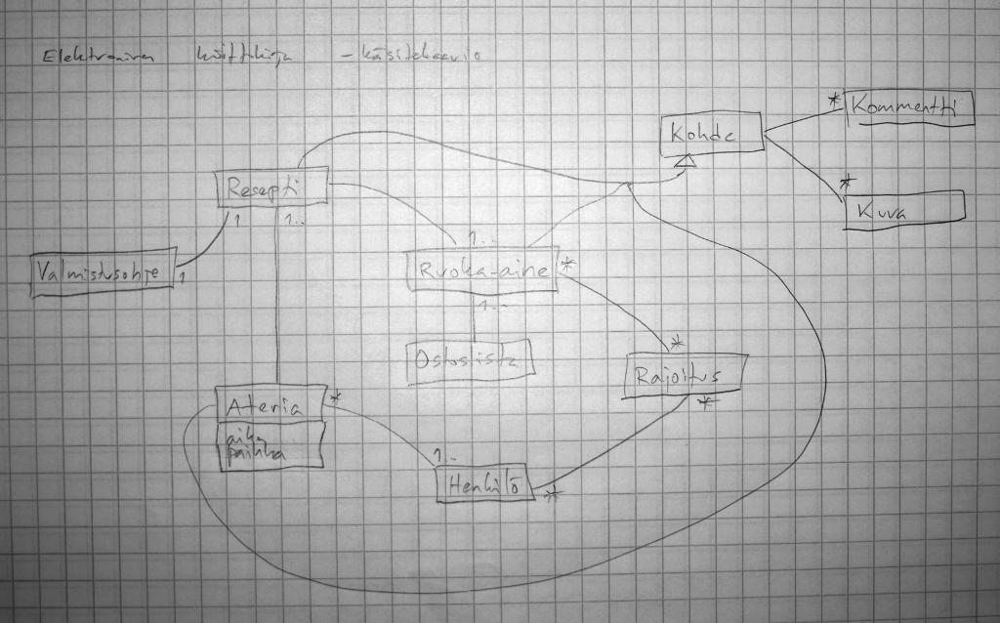

========================
Elektroninen keittokirja
========================

.. contents:: Sisällysluettelo

.. raw:: pdf

  PageBreak

1. Johdanto
***********

Elektroninen keittokirja on websovellus, jonka avulla ylläpidetään
tietokantaa ruoka-aineista, resepteistä ja aterioista sekä
henkilöistä, jotka ovat aterioille osallistuneet. Elektronisen
keittokirjan avulla on mahdollista tehdä ruoka-aineisiin, resepteihin,
aterioihin ja henkilöihin kohdistuvia hakuja. Sovelluksella voi myös
tehdä ostoslistan reseptin tai aterian perusteella. Resepti koostuu
ruoka-ainelistasta ja valmistusohjeesta. Ateria sisältää yhden tai
useamman reseptin ja mahdolliset ruokajuomat. Ateriaan liittyy myös
aika, paikka ja aterialle osallistuneet henkilöt — yhtenä tavoitteena
onkin olla tarjoamatta vahingossa samaa ruokalajia useampaan kerran
samalle henkilölle! Henkilöihin voi liittää tietoja rajoituksista
kuten ruokavalioista tai ruoka-aineallergioista. Lisäksi eri
kohteisiin on mahdollista liittää valokuvia ja kommentteja.

Ympäristö
---------

Ohjelma toteutetaan Python-ohjelmointikielellä CGI-ympäristössä.
Tietokantajärjestelmänä käytetään PostgreSQL:ää.

Ohjelman rakenne toteutetaan käyttäen Model-View-Controller-tyyliä.

Järjestelmän käyttäminen edellyttää tunnistautumista. Tunnistautunut
käyttäjä saa sessioavaimen, joka on voimassa määrätyn ajan
tunnistautumisesta (tai viimeisestä käyttäjän toiminnosta).

Tietokantakyselyjen muodostaminen tehdään niin, että kaikkea
käyttäjältä peräisin olevaa tietoa käsitellään huolellisesti. Tämä
tarkoittaa mm. järjestelmällistä parametroitujen kyselyjen hyödyntämistä.

Hakutoiminnoissa voidaan hyödyntää PostgreSQL:n Full Text Search
-ominaisuutta.

2. Yleiskuva järjestelmästä
***************************

3. Käyttötapaukset
******************

a)  raaka-aineen syöttö ja muutos

b)  reseptin kirjaus ja korjaus

c)  reseptin haku

d)  reseptien katselu

e)  ostoslistan teko valitun reseptin tai ateriakokonaisuuden perusteella

f)  henkilöiden syöttö ja muutos

g)  käyttäjien hallinta

4. Järjestelmän tietosisältö
****************************

5. Relaatiotietokantakaavio
***************************

6. Järjestelmän komponentit
***************************

7. Käyttöliittymä
*****************

8. Asennustiedot
****************

9. Käynnistys / käyttöohje
***************************

10. Liitteet
************

